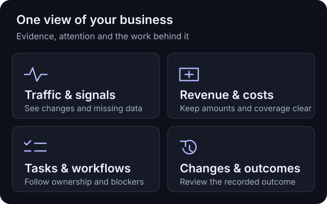

# NoticeOS

<picture>
  <source media="(prefers-color-scheme: dark)" srcset="apps/tower/public/brand/notice-mark-light.svg" />
  
</picture>

## Your startup. In clear view.

**A self-hosted operating desk for your websites and software products.**
See traffic, revenue, costs, alerts and work together—on your laptop, phone or TV.

[](https://github.com/notice-cx/NoticeOS/actions/workflows/ci.yml)
[](LICENSE)

[](https://www.typescriptlang.org/)
[](https://react.dev/)
[](https://www.postgresql.org/)
[](https://www.dolthub.com/)
[](deploy/compose/README.md)



- **Know what needs attention.** See collection failures, unusual traffic and missing evidence.
- **See what earns.** Compare recorded revenue and costs, with dates and coverage kept visible.
- **Keep work moving.** Track owners, blockers, approvals and completion evidence across projects.
- **Check what changed.** Review the follow-up evidence for a change. Completing work is not proof of a better outcome.

The **Tower** is the web app. **Wall** is its at-a-glance TV view.
Missing data stays unknown; it is never silently turned into zero.

## Run from source

For a new local installation, prepare:

| Requirement | Version or setup |
| --- | --- |
| Node.js | 24.21.0 LTS |
| pnpm | 12.8.1 |
| Docker | A running local engine with Docker Compose |
| PostgreSQL client | `psql` available on `PATH` |
| Beads CLI | `bd` 1.3.1 available on `PATH` |

From the repository checkout:

```sh
pnpm install --frozen-lockfile
pnpm start
```

Open **[http://127.0.0.1:4747/](http://127.0.0.1:4747/)** if the browser does not open.
Startup creates a new installation under `.local/start/`, including its own
Postgres store and Dolt task hub. It starts with no user websites or provider
accounts. Later starts reuse that installation; existing databases are never
migrated automatically.

[Startup options and recovery](scripts/README.md#a-new-installation-in-one-command-pnpm-start)
cover a different folder or port. For an existing installation, read the
[upgrade policy](docs/release-policy.md) before changing its code or database.

## Get your first useful view

1. On **Home**, choose **Add your first site**.
2. Open the site's **Data sources** page and connect a source.
3. Open **Overview** to see its first readings. Use **Tasks** for work and **Wall** for the TV view.

Add provider credentials in the product, where they are encrypted in the store.
Products that send their own metrics use the [report contract](docs/02-signal-contract.md)
and [bootstrap credential setup](docs/06-operations.md#bootstrap-secrets-vs-integration-credentials).

## One shared place for work

**Beads supplies the task model; Dolt stores it in one central hub.**
People and agents coordinate the same tasks across NoticeOS and the projects
it manages, with status, ownership, dependencies, approval gates and evidence.
New installations include a NoticeOS task project, so Tasks works before you
add a website. [Connect a project](docs/project-setup.md) walks through asset
setup, shared tasks, repository access, agent instructions and data sources.

Use the **Tasks** page today. A supported task API, installable Claude Code/Codex
skills and hooks, and connections to tools such as Jira or Linear are planned;
they are not available yet.

## Deployment status

| Installation | Use it for |
| --- | --- |
| [Standalone](#run-from-source) | Your own assets, on a trusted network |
| [Docker demo preview](deploy/demo/README.md) | A shared, read-only demo with synthetic assets and ongoing simulated activity |

Standalone has no user login: anyone who can reach it can operate it. Keep it
behind an access proxy, VPN or private network.

The demo package runs the built app, Postgres and Dolt on a Linux server or VM,
including Proxmox. Put its application port behind an HTTPS reverse proxy.
Visitors explore the same product and task model; they cannot change data or
connect real providers. Follow the demo guide for setup, updates and recovery.

Customer account hosting and invitation-based onboarding are not part of this
preview release. Local qualification does not establish a deployed public service.
See the [workspace ownership contract](docs/23-configuration-ownership.md),
[security policy](SECURITY.md) and [release policy](docs/release-policy.md).

## Contribute

Read [CONTRIBUTING.md](CONTRIBUTING.md) for the code map, isolated tests and
review process. Use the public repository's issues and pull requests when
available; access to the maintainers' private task hub is not required.
Report vulnerabilities privately through [SECURITY.md](SECURITY.md).

Useful references: [design docs](docs/README.md) · [operations](scripts/README.md) ·
[repository instructions](AGENTS.md).

## License

Copyright © 2026 Reindex Ventures LLC.

[GNU Affero General Public License, version 3](LICENSE) (`AGPL-3.0-only`).
See [third-party notices](THIRD_PARTY_NOTICES.md) for bundled software and assets.
