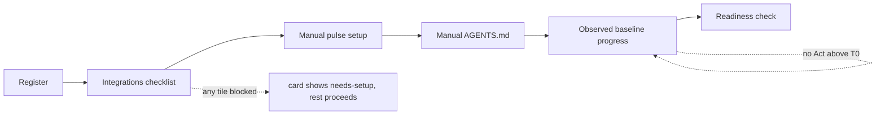
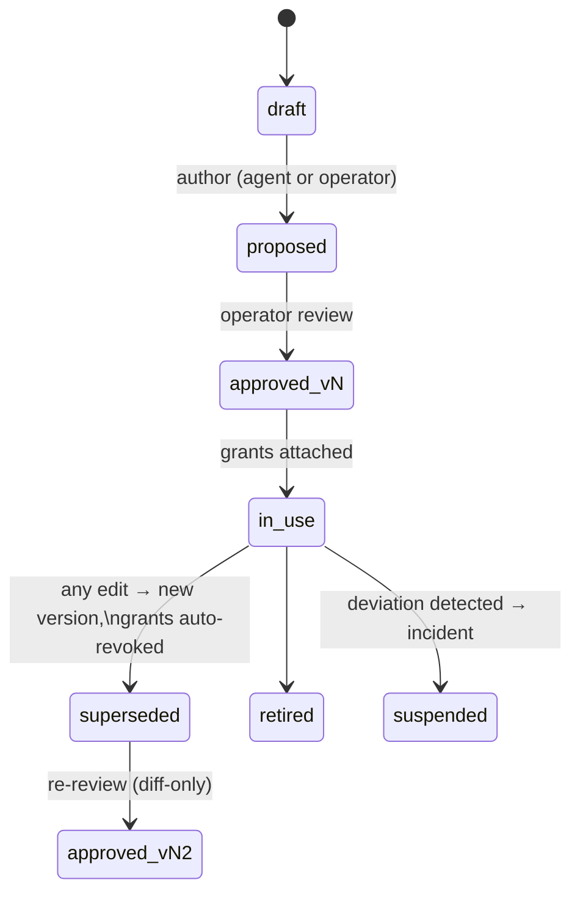
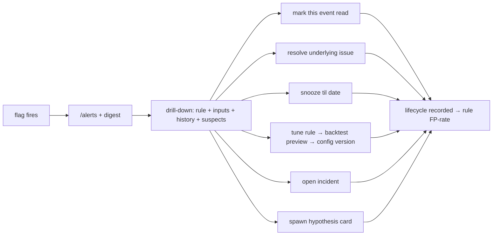

# 15 — Operator flows (every journey, end to end)

*[Doc 10](10-control-tower.md) defines the Tower's surfaces; [doc 14](14-ui-standards.md)
defines the components. This doc defines the **journeys** — every recurring
operator interaction as an explicit flow with entry point, steps, states,
failure paths, and what the system does alone vs where it waits. The rule that
makes this doc load-bearing: **if a flow isn't specified here, agents don't
improvise it — they propose an amendment to this doc first.** That's how the
Tower stays coherent instead of accreting one-off screens.*

## Polish principles (the "visual, intuitive, polished" bar, made enforceable)

These are review-blocking rules for Tower work, same force as doc 14's tokens:

1. **Show, then ask.** Every action with consequences renders its effect
   before committing — a rule edit shows "would have fired 3× in the last 30
   days," a runbook grant shows the exact permission diff, an undo shows the
   revert PR's file list. No blind confirms.
2. **Every state is designed.** Empty, loading, degraded, error, and
   first-run states are specified per surface — an empty queue says *"Nothing
   needs you. Next sweep: tonight 02:00"*, never a blank panel. Skeletons for
   loading; never spinners on the Wall.
3. **Status is spatial and labeled.** Asset identity stays at the top-left
   as its favicon; warning/error severity appears immediately after its name
   only when attention is open. Integration health and freshness keep their
   dedicated header positions, so the operator's eye learns *where* to look
   without a redundant green/gray asset dot. Severity uses only the doc-14
   semantic colors.
4. **One primary action per screen.** Each surface has exactly one visually
   dominant next step; everything else is secondary/menu. If a screen needs
   two primaries, it's two screens.
5. **Undo over confirm.** Reversible **Tower-local** actions (layouts, acks,
   snoozes, pins) execute immediately with a toast + undo affordance
   (Sonner). Anything that deploys, spends, or leaves the Tower (registry
   undo of a shipped change, runbook grants, token revocation, kill-switch
   resume, node retirement) follows principle 1 instead: preview, then
   commit. The two principles divide the world; nothing falls between.
6. **Numbers behave.** Tabular numerals, stable widths, and deltas always
   signed with an arrow and a comparison label. Trends stay neutral; severity
   color is for alerts and emerald is reserved for milestone-kind outcomes.
7. **Microcopy is operator-grade.** Labels say what things are in plain
   words ("Waiting on your review since Tue", not "PENDING_APPROVAL");
   timestamps are relative with absolute on hover. Keep implementation keys
   and storage paths out of ordinary forms; explain effects in product terms.
8. **Latency is honest.** Anything > 1s shows progress with a real basis
   ("verifying 3 gate commands, ~2 min"); background work shows *when* it
   will complete, not that it is "running".
9. **No instruction manual.** The operator is a layman on this system's
   internals by design — every term, control, and process must explain
   itself **in place**, or it doesn't ship. Concretely: plain-language
   labels that describe the choice ("Trusted to ship alone"). Show technical
   identifiers only when the operator needs them for a setup action, such as
   a provider property ID; every status/badge/toggle carries a
   one-line "what this means / what happens next" on hover or tap; every
   process surface (a runbook run, a watch window, a verification) renders
   its stage as a plain sentence ("checking the work by re-running the
   tests — ~2 min"); first use of any surface gets a dismissable one-time
   explainer; and the ⌘K Ask console answers "what does X mean?" from the
   docs. The test is mechanical: a screen fails review if understanding any
   element requires having read docs 00–16. The vocabulary itself is
   governed by the
   [UI lexicon](17-ui-lexicon.md) — UI strings use plain English or
   industry-precedented terms; internal coinages need a justification row
   there. The Tower must be demoable to someone who knows none of our
   terms.
10. **Every knob is visible where it acts.** An asset's entire
    operating state — lifecycle stage, sense mode and its wiring (push or
    pull, endpoint, auth source), the anomaly-rule config in force (default
    or per-asset override), revenue sources, integration scope and observed
    health — is
    surfaced in the Tower on that asset's page: each knob with its
    current **effective value** and an edit control or link to **where it is
    changed in the product**. Settings save to the database (D22); internal
    document keys and file paths belong in diagnostics and developer docs,
    not a Technical details disclosure under every field. Nothing about how
    the OS treats an asset may be discoverable only by reading the repo.
    The test is mechanical: on the
    asset page, the operator can answer "how is this configured, and where
    do I change that?" for every behavior without leaving the Tower.

### Release changes and critical responses (owner decision, 2026-10-01)

A tab talking to a different server release offers **Open app in new tab**.
The existing tab keeps its mounted editors and drafts in memory; neither an
update nor a missing route chunk reloads it automatically or copies drafts to
browser storage. During session revalidation its old requests, queued actions
and completion callbacks stop. A compatibility refusal keeps the frozen view;
an actual sign-out, access failure or verified owner change retires it.

The browser, Worker and local Node API lanes share a source-bound release
identity. A mismatched client is refused before API effects, and a changed,
missing or malformed response identity cannot become a settings or money
result. Headerless operator clients keep their existing API contract. This
metadata grants no authorization (`ro-ujb9.298`).

D41 also requires critical account, settings and money response checks, reusing
the existing account/member decoders and lean checks. That broader validation
and its measured bundle budget are tracked by `ro-ujb9.299`; ordinary API type
assertions do not establish it. Browser checks never replace fresh server
authorization or justify a fabricated default, amount or permission.

### Navigation (2026-09-04, bead `ro-pbzu.1`)

**One sidebar, one page header, canonical nouns.** Navigation lives in the shell
and nowhere else: no page carries a back link. Each
page states what it is exactly once, through `PageHeader` — which is also why the
asset page's identity row is its heading rather than a strip under one. The
canonical asset URL is `/assets` (the index) and `/assets/:id` (the page), with
`/properties` and `/properties/:id` redirecting to them, hash intact. The word
a person reads is **Site** (D31: the nav says "Sites", the add flow "Add a
site"); URL, id, API and task labels keep **asset** (D20), and `/properties`
stays an alias so no link the Tower ever emitted can 404. `/wall` is outside
the shell and keeps its single quiet way home.

### Realtime asset glance (implemented 2026-07-29)

The Wall's site rows show GA4 trailing-window active users as a **minute
pulse** (D34, `apps/tower/src/components/wall/LiveUsers.tsx`): users in the
last **30 min** as a labelled number, one bar per minute, and the last **5 min**
bright with their own count. There
is no operator control: these are observed provider facts. The browser refreshes them
independently every 30 seconds so a slow realtime provider cannot block the
main Wall payload; Home's assets panel and the `/assets` table read the same
snapshot for an asset's intraday pace. A reading older than three minutes
drops to neutral ink beside its age, a failed read keeps the last pulse dimmed
with the failure's label (*Checking traffic*, *Reconnecting*, *Live traffic
unavailable* — `apps/tower/shared/live-traffic-health.ts`), and an asset with
no GA4 or no reading yet shows a dash.

The same 30-second display poll also refreshes a today-by-hour chart above the
daily history. Today's solid line stops at the newest reported hour on the OS
clock (the operator's `os_time_zone` setting; the caption says which) while the dotted same-weekday reference
spans all 24 hours. Its pace compares the same elapsed hours, never a partial day with a
complete day, and future today hours are absent rather than zero. It also
compares the same real hours across a reporting-timezone change, because each
provider hour is converted with the clock in force on its own date; the ⚠ on
the intraday pace appears only for the two days the change itself distorted,
not for every window that spans it. The large DAU
number remains the exact distinct-user value from the 15-minute durable
collector because hourly active-user counts overlap.

### Reporting days and display timestamps (owner decision, 2026-10-01)

Provider reports keep their own reporting day and readiness cutoff. Mediavine
revenue uses its Pacific reporting contract; a UTC operator does not make the
report ready sooner. Ordinary timestamps display on the saved operator clock.
A daily report's date is labelled with its reporting basis rather than silently
rebucketed. The revenue readers share the declared provider contract
(`ro-ujb9.300`, D42); incompatible reporting days show coverage without a
combined total. Ledger booking periods and intraday traffic's existing clock
conversion above are unchanged by this revenue decision.

## Coverage matrix

| Flow | Surface(s) | Previously specified | This doc adds |
|---|---|---|---|
| A. Onboard an asset | Onboarding wizard → asset card | doc 12 nodes, doc 09 example | the wizard itself, states, exit criteria |
| B. Enable/amend a runbook | Runbook library | doc 05 trust model | lifecycle states, review screen, revocation |
| C. Set up an integration | Asset detail → integration tiles | doc 11 catalog + states | guided setup, validation probe, rotation |
| D. Edit dashboards | Wall (edit mode) | doc 10 (read-only Wall) | tile library, layout config, threshold editing |
| E. Observability & triage | Attention band → drill-down | doc 02 flags, doc 06 | the triage loop, ack/snooze/tune, FP feedback |
| F. Review the queue | Queue | doc 10 (approve/boost/veto) | veto-reason capture, batch patterns |
| G. Undo a shipped change | Registry | doc 10 (one-click undo) | preview, verification, watch-window annotation |
| H. Kill switch & resume | Global header | doc 06 | drill cadence, resume ceremony |
| I. Budget-cap events | Wall banner + digest | doc 06 caps | pause/raise/resume flow |
| J. Scout-find triage | Scout inbox | doc 13 lanes | promote/archive mechanics, lane feedback |
| K. Weekly review | Digest → calibration strip | doc 03/04/07 | the 30-minute ceremony, ladder sign-offs |
| L–R. Ask · Investigations · Commissions · capture · visual evidence · research · propagation | console + queue + registry | — | [doc 16](16-replacing-the-chat-workflow.md) (same contract as this doc) |

## A. Onboard an asset (repo → living asset card)

1. **Register** (2 min): name, repo URL, entity, expected measurability tier
   (doc 03), revenue families expected, invariant seeds (e.g. example.com's YMYL
   rules). Creates the asset row in state `onboarding`; the **desk** immediately
   shows a checklist ring (visual progress from minute one), on the
   two surfaces setup is actually done from — the asset page's Overview and
   its Data sources tab (see [the checklist ring, as built](#the-checklist-ring-as-built-2026-09-04-bead-ro-28ma)
   for its items). **The Wall is deliberately not a third** *(decided
   2026-09-05, bead `ro-jkiu`)*: the ring is a to-do list, its meaning lives in a
   hover a television has no pointer for, nobody sets up an integration from the
   sofa, and a mark on the compact card spends part of the 1080-pixel budget
   `pnpm wall:fit` protects. The Wall card carries the one setup fact that reads
   at three metres — **no report has arrived yet** — and nothing else.
2. **Integrations checklist** — auto-generated from the doc-11 catalog
   filtered to relevance (relevance = the catalog rows whose "consumed by"
   lanes the asset's registration enables; the operator can add/remove).
   Each tile: `needs-setup → validating → live` (flow C), or **`skipped`** —
   a first-class fifth state in doc 11's enum (relevant but declined for
   now, reason required; renders as a hollow notch) — distinct from
   `not-applicable` (catalog says it never applies). The card's checklist
   ring fills as tiles resolve (the registry's `ProgressRing`, bead
   `ro-28ma`). All five lane states except
   `needs-setup` count as settled, so a `degraded` lane does not hold the
   checklist open — a lane that is set up and failing is an alert, not an
   unfinished setup step.
3. **Pulse endpoint — manual for the first release.** The operator follows
   the pulse runbook (doc 02 envelope) and reviews the asset's code change.
   NoticeOS does not automatically open an onboarding PR. This keeps repository
   changes under operator review without making automated code setup a release
   prerequisite. **Sense-only light nodes** skip this step and remain explicitly
   `not-applicable`; central signals do not imply that a pulse endpoint exists.
4. **`AGENTS.md` setup — manual for the first release.** The operator uses
   [doc 09](09-onboarding-a-site.md)'s template, reviews the repo and states the
   invariants, do-not-touch and brand rules. The freshness clock starts only
   for the document actually written (doc 04). No automated scan or interview
   is claimed, because the operator must review these rules before use.
5. **Observed baseline progress.** On the site's Sources tab, open **Data setup**
   to see *N of 28 days* of nightly reports. The shared derivation counts
   distinct stored dates in the last 28 completed UTC days; today's report,
   duplicate revisions and older reports cannot fill a missing day. Missing or
   invalid coverage reads **Unknown**, never elapsed-time completion. Sites
   begin owing this coverage after their first nightly report (D29); declaring
   no nightly report removes the step. The same checklist serves phone and
   desktop (`apps/tower/shared/asset-setup.ts`, `ro-ujb9.296`). This progress does
   not arm anomaly rules, change thresholds or grant Act authority.
   Existing starting tiers and runbook grants
   remain governed by docs 02/05; doc 07's 14-day ingest-health exit is a
   different pipe-health condition.
6. **Agent execution — manual for the first release (D43).** The asset's
   external agents remain operator-managed. Show the **Pause check** as
   **Unavailable** because NoticeOS has no asset agent execution service to
   test (`ro-ujb9.297`). It is neither a passed check nor an unfinished data
   setup requirement. Pausing a collection schedule does not stop external
   agent work. Resolving data setup never grants Act authority or promotes a
   site or agent's tier. Flow H describes the future execution service's
   required pause contract (`ro-lwo6`), outside the first-release cutoff.

**Failure paths:** repo unreachable → tile-level error with the exact fix
("App not installed on repo — install link"); manual setup incomplete →
its existing setup step remains pending; missing baseline data → observed
coverage or unknown, never an elapsed-time completion. An incident does not
automatically reset the measurement window or its protected rules.

### One screen, as built *(2026-09-23, bead `ro-ujb9.96.7.5`)*

The five steps below became one question: **Add a site** opens a card over the
page it is pressed on (Home's first-run step 1, the Assets header, the sidebar;
`/assets/new` is the Assets page with the card open), and the **domain** is the
only field. The name is read off the domain and replaced by the site's own
name when its home page answers; the icon is its favicon or its initial; one
optional press, **Not launched yet**, starts it in pre-launch. Add writes the
same row and the same one changeset the wizard wrote from its defaults, and
lands on the asset's **Data sources**, where every source not connected has
one **Connect**. Each default the wizard asked is changeable afterwards on the
asset's page — the table, the write path and the prior art are in
[docs/briefs/2026-09-23-add-site.md](briefs/2026-09-23-add-site.md). Measured
by the flow gate (`apps/tower/ux-flows.json`): adding a site is 2 clicks and 1
field on 2 screens; a new site to its first data is 5 clicks and 2 fields.

### The wizard, as built *(2026-09-04, bead `ro-qsoo`; superseded 2026-09-23 by the one-screen add above)*

The five-step wizard is gone; the one-screen add above makes the same writes,
and what survives of the wizard is its write path:

**Two writes, row first.** `POST /api/assets` creates the row; then ONE
changeset through `PUT /api/config` — one archived document, one commit. Its ops
are inserts, plus one **set** when an entity was picked: an asset is not born
into an entity, it is added to the list on an entity's own row, which already
exists (bead `ro-aodz`). The row goes first because its `409 asset_exists` is the
only authoritative duplicate check (the card's own is a cached read of the
wall payload), so the cheap guard is spent before anything is written. It is
also the only leftover the operator can see and remove: an orphaned row shows on
`/assets` and `DELETE /api/assets/:id` takes it away, while an orphaned config
entry is invisible to every payload builder.

**Failure states.** `409` reads *Already added* beside the domain field, with
the way to the asset that holds the id. `422` puts the store's own sentence
beside the field it named. A deployment whose store cannot take a write
**disables Add** with that deployment's reason (`useConfigWritable`), because a
store row with no config entries is a half-made asset. And in the one case the
flow cannot make atomic — the row lands, the lane then refuses — the card says
so and offers **Retry setup**, with the changeset shown and copyable
(`apps/tower/src/components/AddSite.tsx`).

**The owning entity has a home** *(bead `ro-aodz`)*:
[`config/entities.json`](../config/entities.README.md), a portfolio register of
legal entities, each carrying the asset ids it owns. The fact is stored ONCE, on
the entity — an asset's owner is read back out of those lists — so
`/settings` → **Entities** declares and corrects the entities
themselves, and the asset's own **Settings → Identity** card is where an asset
moves between them: one change that takes the id off the old list on its way
onto the new one, which is what keeps "an asset belongs to one entity" true by
construction. An install that has declared none says so and points at the page
that declares one.

**First-release scope (owner decisions, 2026-10-01, D40/D43).** Pulse endpoint
implementation and asset `AGENTS.md` setup stay manual for the reasons above;
a fetch endpoint, format and totals remain editable on the asset's **Data
collection** card (`apps/tower/src/routes/asset-detail/CollectionSetup.tsx`).
Observed baseline progress is implemented (`ro-ujb9.296`). Asset agent execution
stays manual, and its pause check must read unavailable (`ro-ujb9.297`). The
coverage count establishes neither execution readiness nor permission to arm
rules. The future execution service is tracked separately in `ro-lwo6`.

### The checklist ring, as built *(2026-09-04, bead `ro-28ma`)*

An asset in
`onboarding` or `baselining` carries a checklist, and every item of it is
read from the asset's own live state. Nothing is stored, and nothing is tickable:
a box the operator could tick without doing the work would be the one part of the
page that can lie.

| Item | Resolved when | Goes to |
|---|---|---|
| **Identity** | the asset carries a name of its own rather than echoing its id | the Settings tab |
| **Data sources** | no applicable lane is left `needs-setup` (step 6's exit test) — `live`, `degraded`, `skipped` and `not-applicable` all count as settled, and each lane's own state and reason are listed | the Sources tab |
| **First nightly report** | one has arrived. Before any report the row is an **offer** — *Nightly report · Optional*, listed and never counted — and an asset declared as sending none has no row (bead `ro-ujb9.96.8`) | `/health`; the offer goes to the Data collection card |
| **28 days of reports** | 28 distinct report dates in the last 28 completed UTC days; *Unknown* where the payload cannot say | `/health` |

**Two renderings of one derivation.** `apps/tower/shared/asset-setup.ts` owns
the items, their sentences and their destinations; the asset page's Overview
(the ring in its status banner) and its Data sources tab (the list) call it. It returns `null`
for a live asset, which is the mechanism behind *the ring disappears when the
asset goes live* — no surface holds an opinion of its own about which stages
count as setup.

Three decisions worth naming.

- **Coverage is counted from stored report dates, not from registration.** An
  asset registered forty days ago whose reports began five days ago has five
  days of coverage. A ring counting from the row's `created_at` would fill on
  evidence that does not exist and claim the anomaly rules could arm.
- **The nightly-report lane is counted once.** It rides in the same fixed
  seven-slot source inventory the data-sources item reads, so the derivation
  excludes it there — otherwise a four-segment ring would move two segments on
  one event ([doc 14](14-ui-standards.md), one representation per fact).
- **The Wall does not draw it** *(decided 2026-09-05, bead `ro-jkiu`)*. The
  ring is a to-do list,
  its meaning lives in a hover a television has no pointer for, and nobody sets
  up an integration from the sofa; the compact Wall card's own no-report block
  already states the single fact that matters at three metres, and a wall-scale
  ring would spend part of the 1080-pixel budget `pnpm wall:fit` protects to
  repeat it. The ring stays a **desk** element on its two surfaces.

## B. Enable, amend, revoke a runbook

- **Review screen** (the trust ceremony, doc 05): left pane = the procedure
  (steps, tools, gate commands); right pane = the **permission manifest
  diff** vs the prior approved version, rendered like a code review. Below:
  a required **dry-run transcript** (the runbook executed against a sandbox
  or with writes stubbed) — approving without a dry-run is structurally
  impossible, the button doesn't exist until one is attached.
- **Grants** are `(runbook@version × asset × change-class × T-level)` rows,
  each displayed in plain words: *"v3 of `refresh-affiliate-catalog` may
  open PRs on example.com, class content-data, and merge them (T2)."*
  One click shows every run that grant has authorized.
- **Amendment**: any edit mints a new version and **auto-revokes** standing
  grants; re-review is diff-only (5 minutes, not a re-read). No
  patch-level exceptions — the whole point is that permissions attach to
  reviewed text, and "minor edit" is where the bodies get buried.
- **Deviation** (a run acts outside its manifest): hard-stop the run,
  suspend the runbook's grants portfolio-wide, open an incident (doc 06).
  The Tower shows *what* deviated — expected manifest vs attempted call.

## C. Set up an integration (per asset)

### The credential half is built *(2026-09-04, bead `ro-vu8d.2`)*

`/integrations` is the page an operator opens in order to MAKE a connection;
`/health` can only observe one. One row per credential-holding provider
(Google for GA4 + Search Console and its OAuth app, Bing Webmaster, DataForSEO,
calendar feeds, Discord, Microsoft Clarity, PostHog, Mediavine —
`packages/contract/src/integrations.ts`), each with:

- **State as a glyph, not a word to read**: one status model for this page, an
  asset's Data sources rows and the Wall (`apps/tower/shared/connection-status.ts`)
  — Not connected, Checking, Key accepted, Collecting, Working, Failing, Not
  using, Overdue, Unknown. *Legacy env* is the credential still coming from the
  environment file rather than the store — working, not broken, and deliberately
  not amber for that reason ([doc 14](14-ui-standards.md)). Since bead
  `ro-vu8d.7` that card carries **Import from this machine**: one press moves the
  whole secrets file into the store and the card re-renders Connected. Where the
  OS is not running the press cannot exist, so the card shows
  `pnpm dev:secrets:import` and the deployment's own reason instead.
- **Connect / Replace**, in the connect panel over the page
  (`apps/tower/src/components/ConnectPanel.tsx`), a form generated from the
  provider's field schema in
  `packages/contract`: a password masked, a service-account JSON pasted or
  uploaded from the file Google hands you, feed URLs one per line; then the
  account's sites matched to assets and **Start collecting**. Step 1's
  "single paste field" is this, and step 1's "reusable credentials are entered
  once, then assets are enrolled" is unchanged — a shared credential is one card,
  and the card names the assets it already serves.
- **Test connection**, which is step 2 made real: one live authenticated call,
  answered with a glyph, a sentence and a time. There is still no manual health
  toggle anywhere.
- **Disconnect** behind one confirming press that names the provider
  (`apps/tower/src/components/ConnectionActions.tsx`). This is step 4's revocation, and
  it remains the one confirm-gated action on the page — principle 5 sends it to
  principle 1, because there is nothing to undo a deleted plaintext back to and
  it stops every lane the credential powers.
- **First run**: every card Not connected, each with the one-line *what you
  need* from [doc 11](11-integrations.md)'s catalog.

**Nothing is ever echoed back.** The read returns field names and timestamps
only, so a stored field renders as *set* and Reconnect opens empty inputs — a
pre-filled password field would be a claim that the browser knows the password.

**The page is never read-only.** Credentials are store writes, so it works the
same in a deployed Worker as on the operator's Mac — the shape of every other
setting (D22).
Two bootstrap facts can still block Connect, stated once at the top of
the page with their exact commands: the `credentials` table has to be applied
(operator-only) and `CREDENTIALS_KEY` has to be set. Disconnect stays live
through both, and every card still shows what the OS is using today.

### Google is connected by signing in *(2026-09-05, bead `ro-vu8d.3`)*

The Google card has two ways in, and the service-account paste stays exactly
where it is — an install already running on one is not asked to move.
Full mechanics in [doc 11](11-integrations.md#connecting-google); what belongs
in *this* flow is what the operator meets, in order:

*Steps 1–4 happen in the connect panel (bead `ro-ujb9.96.7.7`): the console
steps as two deep links and the dropped
`client_secret.json`, Continue with Google, and the account's GA4 properties and
Search Console sites matched to each site's row with Start — [doc
11](11-integrations.md#connecting-in-the-panel-2026-09-23-bead-ro-ujb99677). The
card below remains the provider's page.*

1. **Nothing to sign in to yet.** Google has to be told this OS exists, so the
   card shows the five Google Cloud console steps and asks for the OAuth client
   ID and secret — stored encrypted like any other credential, and never a card
   of its own, because they configure *how* you connect Google rather than being
   a second thing to connect.
2. **The redirect address, verbatim, with a Copy.** One string that has to match
   on both sides, derived from the address this browser is on, printed inside
   the console step that needs it. A mismatch is the commonest OAuth failure and
   the whole reason this is shown rather than described.
3. **Sign in with Google** — a plain link, because the flow is a full-page trip
   to a consent screen and back, and the operator returns to `/integrations`
   with a toast. Failures come back as a code the page turns into its own
   sentence; nothing Google said is reflected into the page.
4. **Connected as ops@example.com**, with what the grant covers listed in words
   rather than scope URLs, and *What can this account see?* — a read-only list of
   the GA4 properties and Search Console sites that account can reach. It
   answers the question a sign-in raises immediately: *did I use the right Google
   account*. Turning that list into a per-asset picker is `ro-vu8d.4`.
5. **Disconnect also revokes at Google**, and the confirmation says so — this is
   the one action on the page that reaches outside the OS, into the operator's
   own account permissions.
6. **When Google stops accepting the sign-in** *(2026-09-05, bead
   `ro-vu8d.14`)*, the card says so instead of keeping a tick beside the
   address. `invalid_grant` at the token endpoint — a Testing-mode grant that
   aged out, a permission the operator removed from their Google account, a
   rotated client secret — records one sentence in the credential's own column:
   *Google revoked this sign-in — Testing-mode grants last 7 days. Sign in again
   on the Integrations page, or publish the app in the Google Cloud console so
   the grant stops expiring.* It names the likeliest cause and both ways out,
   because "reconnect" alone leaves an operator doing this every week. The
   account address stays on the card (it is what says **which** account to sign
   back in as), the granted scopes go neutral, and **Sign in again** becomes the
   loudest control rather than a muted link.

**The loopback dance is the local case worth knowing.** `os:up` binds the LAN by
default and Google refuses every plain-http redirect that is not loopback, so a
card opened at `http://192.168.1.20:5173` says so and names
`http://127.0.0.1:5173` instead of letting the operator find out from an
`invalid_request` on Google's own page. Connect once there; every other device
then reads the connected card from the LAN like every other page.

### The per-asset half is built *(2026-09-05, bead `ro-vu8d.4`)*

The credential is one card on `/integrations`; **which property, site or scope
each asset maps to is that asset's own Sources tab**, on the lane card that
already answers whether the lane is working. The lane's card under the verdict
holds the mapping fields and the one posture decision the operator makes (in
use, or **Not using**); the row's status is the proof, and a row's one action,
Connect or Fix, opens the connect panel over the site's own page (bead
`ro-ujb9.96.7.4`) — see [doc 10](10-control-tower.md) for the full account.

Four things this flow says out loud:

- **A save reaches the next collection run, not the next restart**
  *(2026-09-05, beads `ro-syok.7` and `ro-7xv2`)*. Once an install has seeded,
  the ingest resolves `config/integrations.json` from the store on every cron
  fire and hands it to each collector, so the property saved on the Sources tab
  is what the next run asks for — never mid-run, but never a restart either.
  An install that has **not** seeded still reads the copy compiled into both
  Workers, where a hand-edited file waits for a `pnpm os:up` restart or the next
  deploy. The tab prints whichever of those two is true of this deployment,
  derived from the file's own entry in `GET /api/config`'s `sources` rather than
  stated, and each run's completion line records the same word.
- **The mapping is what the collectors ask** *(bead `ro-vu8d.16`)*. One resolver
  in the ingest (`workers/ingest/src/lane-mapping.ts`) reads these fields first
  and falls back, per lane, to what each read before: the Google credential's own
  property map, the asset's own domain matched against Bing's verified sites, the
  US/English DataForSEO baseline. The card prints whichever is true of this
  asset, and each run's completion line tallies which one answered. A Google
  sign-in plus a mapping is now a whole setup: no account map to paste.
- **The Google credential's own copy of that mapping retires itself**
  *(bead `ro-90mr`)*. `GOOGLE_SIGNAL_ACCOUNTS` holds a `ga4_property_id` /
  `gsc_site_url` per asset, which is the same fact in a second place — a state
  D21 and the one-representation rule both refuse to make permanent. It now
  answers **per data source, and only while it still has to**: the collector
  asks the register about every asset the credential names, and where every one
  of them is mapped it stops reading those two fields entirely. There is no
  migration and no operator step, because the day it flips is a provable no-op —
  a value the register held was already winning. The provider's own card on
  `/integrations` says which of the two sentences is true, naming each asset ×
  data source still waiting, so an operator can tell when the ids in their
  stored secret became dead weight. **One function answers that, and it is the
  collector's** *(2026-09-05, bead `ro-vu8d.22`)*: the ingest reports the answer
  on the credential summary, because only the ingest can read the account map
  and the question is *which assets does the credential name* — a register-only
  answer misses an asset the credential names with no register entry. What
  crosses the wire is asset ids and data-source ids, which the card already
  carries.
- **The GA4 property and Search Console site are picked, not typed**
  *(bead `ro-vu8d.17`)*. The connected account's own list fills both fields, each
  option showing the name, the account or permission level, and the value that
  gets stored. The free-text box stays for a service-account install, for a
  property the account cannot see, and for a discovery that failed — none of
  which may cost the operator the field.

Step 1's guided setup is per lane and per asset rather than only per
provider; step 2 is unchanged.

A mapping that reaches a collector without an `os:up` restart is built
(`ro-7xv2`, proved against the store by
`workers/ingest/test/config-reaches-collectors.test.ts`).

### An expiring credential warns before it stops the collectors *(2026-09-05, bead `ro-vu8d.8`)*

Step 4's T-14d warning is built. What it warns about is a **date the OS can
honestly know**, and the design turns on never inventing one:

| Provider | Can a date be known? |
|---|---|
| Google — the **sign-in** | Yes. A consent screen left in **Testing** expires every refresh token **7 days** after it is granted, and the self-hosted console setup ([doc 11](11-integrations.md#connecting-in-the-panel-2026-09-23-bead-ro-ujb99677)) makes a Testing screen. The OAuth exchange records the date. |
| Google — the **service account** | No. A service-account key has no stated lifetime. |
| Bing Webmaster · DataForSEO | Only if the operator says so. Neither provider states an expiry, so the card offers a date field for a rotation they have planned, and stays empty until they use it. |
| Calendar feeds · the Google OAuth **app** | No, and the card says so. A secret ICS address and a client secret die on an **action**, not a date. |

- **The countdown is a chip beside the state chip, not a fifth state.** *Does
  this work now* and *until when* are two facts. A credential three days from
  expiry is still Connected and still collecting; once it actually stops, the
  state chip turns Failing off the collector's own evidence, as it always did.
- **Warn-toned only inside the window.** Muted while the date is far off,
  `warn` inside fourteen days, `error` once it has passed. No new token and no
  fourth severity — an expiring credential is an ordinary warning.
- **The Google assumption is stated, not hidden.** Google publishes no API that
  reports whether a consent screen is published, so the card says what it
  assumed and offers one press — *it does not expire* — which the store records
  as the **operator's** answer. No later sign-in can overwrite it, so the
  correction is made once rather than after every reconnect.
- **Where the warning goes: the Integrations card, and a dot on the sidebar's
  Integrations entry.** Deliberately **not** the attention band through the flag
  lane. `flags.asset` is `NOT NULL REFERENCES assets(id)` (db/0001) — every flag
  is a statement about one asset — and each of these credentials is
  portfolio-shared, so "the DataForSEO password expires in nine days" belongs to
  no asset, and filing it against asset #0 would put a credential's lifecycle in
  the OS self-pulse lane, which counts pulses and cron runs and **resolves on a
  pulse**. An expiry resolves when the operator reconnects. D15 settles the rest:
  where a roll-up and an action list describe one fact, the action list owns it —
  and the action list here is the card, because Reconnect is on it. The dot is
  the pointer that gets an operator there without opening the page first.
- **Recording a date never means retyping the credential.** It is a non-secret
  fact stored beside the ciphertext, so `PUT /api/integrations/:provider/expiry`
  re-seals nothing, needs no `CREDENTIALS_KEY`, and leaves the last verdict
  standing.

**The card and the nav dot are the CEILING** — decided 2026-09-05, bead
`ro-vu8d.19`, which asked the question again: `/wall` shows nothing and Home's
Alerts list shows nothing, so should either carry it? **No**, and four reasons
point the same way.

1. **D15, again.** The Wall's *Needs you* list and Home's Alerts list are both
   roll-ups of the action list that owns this fact. The rule does not stop
   applying because the roll-up is on another page.
2. **Nobody can act from the Wall.** It is a television; Reconnect is a desk
   action. `apps/tower/shared/materiality.ts` already refuses the TV's scarcest
   space to a row nobody is being asked to act on — written down for `snoozed`,
   and an expiry countdown is exactly that row. It would also cost a new
   top-level payload key, a materiality declaration and height the fixed budget
   (`pnpm wall:fit`) does not have.
3. **The Wall already tells the truth when it matters.** A credential that
   actually expires stops its collector, and a stopped collector is a `degraded`
   source on the asset cards and a gap in reporting coverage — **observed**,
   rather than a prediction the TV would carry for fourteen days to be right
   once.
4. **Home is a desk page**, so the sidebar's dot is already on it. A second mark
   in its Alerts list would be D15's duplication exactly.

The small screen, where
the sidebar lives behind a Menu button — a ceiling the operator cannot see on
their phone is not a ceiling — wears the same dot, from the same
`expiringCredentialSeverity` and one shared sentence
(`expiringCredentialSummary`), so the mark and its hover cannot drift between
the two places they appear.

### The card says what *Test connection* will do, before the press *(2026-09-05, bead `ro-vu8d.18`)*

Discord is connected in the product like every other provider, which keeps the
promise that a fresh install needs only the bootstrap secrets
([doc 06](06-operations.md#bootstrap-secrets-vs-integration-credentials)). Its
card states the one thing step 2 had left implicit:

- **Its test posts, and that is the honest choice.** Discord offers a cheaper
  read of the webhook object, and it proves the wrong thing:
  `config/integrations.json` defines this data source as live when the OS *can
  deliver a notification* — "not merely that a webhook URL exists" — and a
  webhook whose channel the operator lost access to still answers a read. So
  the test does what the credential exists to do, and the message it posts says
  what it is and that nothing is wrong, because it lands in the channel somebody
  watches for real alerts.
- **So the cost is declared, and printed under the buttons.** What pressing Test
  does is a per-provider fact in `packages/contract` rather than something each
  card guesses (`ProbeCost`): `free` for a read-only probe, `side-effect` for
  Discord, `none` for a test that calls nobody (the Google OAuth app, Clarity).
  Only the
  last two print a sentence — describing a free read on every card would be
  noise to make two legible — and it is muted rather than amber,
  because neither is a fault. A button that surprises somebody once is a button
  they stop pressing.
- **The url is the credential.** It never appears in a verdict, a log line or a
  refusal, exactly like a secret calendar address. It is *not* masked, for the
  same reason the feed map is not: an operator who cannot proof-read the address
  they pasted cannot see the mistake that makes it 404.

### The OS sends, and says what it will send *(2026-09-05, bead `ro-vu8d.23`)*

An hourly lane writes to it (`workers/ingest/src/notifier.ts`), and the design
question was never the plumbing — it was WHAT is worth interrupting somebody
for.

- **Two things, and they are written down.** A **new open error alert**, and a
  **data source that stops working**. Error only: `warn` is the severity doc 02
  gives to something to look at eventually, and eventually is what `/alerts` is
  for. Never a digest of the open set — that would be this desk again, at 3am,
  in a channel with no Mark read on it.
- **The card says it before the press.** The two conditions are one declaration
  in `packages/contract`, read by the sender and printed on the card that asks
  for the webhook — so "what will land in my channel" is answered where somebody
  is deciding whether to connect it.
- **Once per condition.** The lane runs hourly, so it keeps a record of what it
  has already said (`notifications`, db/0031) and writes it **only when a message
  actually landed**. A failed delivery is retried next tick and stamps the
  credential, so the card turns Failing off a real send rather than off a button.
- **The alert row says it was sent.** A *notified* mark with its time sits among
  the row's other dated facts on the asset page and in `/alerts`' History, which
  answers the question an operator brings to every list: *did I already know
  about this?* An unmarked row is one they were never interrupted for.
- **D15 decides where it does NOT appear.** The mark is on the action list and
  nowhere else — no Wall row, no second count on Home. And the notification is a
  pointer to the desk, not a copy of it: everything the OS knows stays on
  `/alerts`.
- **Without its table, the card degrades out loud.** db/0031 is
  operator-applied like every migration; an install that has not applied it
  holds a working webhook and sends nothing, and the card states exactly that
  (*Not sending*) with the command that clears it. A notifier that sent without
  being able to record would repeat itself every hour, which is the failure mode
  the whole list exists to avoid.

### The first per-asset credential, and a test that calls nobody *(2026-09-05, bead `ro-vu8d.9`)*

Microsoft Clarity's token is issued **per project**, and its export API has no
call cheap enough to press a button on. Both shape what this flow does for it
(`workers/ingest/src/clarity-dumps.ts`):

- **A per-asset credential is still one credential.** The card holds an
  `asset id → that asset's token` map in the same single encrypted row every
  other provider uses. A compound key would have been a migration
  ([operator-only](../AGENTS.md)) to answer a question a JSON object already
  answers. What *per-asset* changes is what the operator sees.
- **The shape it replaced is still readable, and now says so.** The older
  single-project binding an install may still hold is declared as one entry of
  that map *(2026-09-05, bead `ro-vu8d.24`)*, so the card reads Connected for
  that asset instead of Not connected over a working collection, Connect moves
  it into the store with everything else, and the export still records which
  binding actually held the token. It gets no input on the form — a box offering
  "the token, but only for one asset" would teach the shape the map replaced.
- **The form asks per asset.** One input per asset, ids printed rather than
  typed, drawn from the same list the card shows above it — handing somebody a
  JSON box to write braces into around a secret is asking for the syntax error.
  It opens empty like every form here and a save **replaces** the map, so it
  says so above the inputs and marks the rows a key is already stored for.
- **"Which assets does this credential serve" is a checklist, not a roll call.**
  Partial coverage is the normal state for a per-asset credential, so each asset
  is ticked or dashed for whether a key is held. Two facts feed it — the catalog
  says who declares the data source, the store says who has a key — and they are
  merged once, in `packages/contract`, so the card and its form cannot disagree.
  An asset waiting on a token is the most actionable row on the card; a token
  stored for an asset nothing maps is named rather than hidden. A dash is not a
  red mark: work outstanding is not a fault.
- **Step 2's rule is kept by refusing to pretend.** Ten calls per project per
  day and no free endpoint means the cheapest probe available would spend a
  tenth of one asset's budget. So *Test connection* reports which assets hold a
  token, says plainly that it did not call Clarity — and, because it proved
  nothing, **does not stamp the verdict**. That rule is now the declaration's,
  not Clarity's: any provider whose test makes no call leaves `last_ok_at`
  alone, which also stopped the Google OAuth app's shape check from putting a
  green tick on an unproven credential.
- **The 04:30 export is the proof.** The nightly collector resolves the map
  store-first, records `store:CLARITY_TOKENS` on each run, and stamps the
  credential with what actually happened — so the card's verdict comes from a
  real collection, in the ingest's own error codes, rather than from a button.

### The flow as specified

1. Tile starts `needs-setup` with **guided setup instructions**: exact
   scoped-token
   instructions per provider (the doc-11 row rendered as steps: "GSC →
   Settings → Users → add service account X as Full"), a single paste field,
   and a note on where the secret lives — **the store, entered here**
   (encrypted under `CREDENTIALS_KEY`; an env binding is the legacy fallback for
   an install that has not moved, and the card says so with an Import button —
   [doc 06](06-operations.md#bootstrap-secrets-vs-integration-credentials)).
   Reusable credentials are entered once, then assets are enrolled under
   that account; the UI never asks for the same key again per asset.
2. **Validation comes from a real collector attempt** (doc 11 names it per
   integration). A fresh success shows a live data sample ("GSC: 1,204 queries
   yesterday ✓"); an error shows the provider's actual failure and likely fix.
   There is no manual health toggle: fresh success → `live`, error/stale →
   `degraded`, and no run → `needs-setup`.
3. `live` tiles display **quota reality** from doc 11 (Clarity: "7 of 10 calls
   left today") so the operator never wonders why a lane paused. On the
   provider card (`ro-vu8d.25`), the design turns on
   never spending the budget to read it: Clarity's export writes one manifest
   row per call, so what is left today is a COUNT of rows this OS wrote — the
   same `signal_dump_runs` rows the metered spend figure is summed from — and no
   provider call is made to render it. Per asset, because the cap is per asset;
   only assets holding a key are listed, because an asset that cannot spend has
   no budget to show; and a provider with no meter draws nothing rather than a
   full bar, which would read as a measured zero. Whether a provider HAS a
   countable meter is declared in `packages/contract`.
   **Both metered providers answer** (`ro-qpas`): DataForSEO's
   ceiling is not calls but the portfolio's `monthly_caps.data_usd` reserve, so
   its card shows what is left of THIS MONTH'S data cap — one line rather than
   one per asset, because that cap is portfolio-wide — read through the very
   function `/health`'s spend summary and `/settings`' budget meter already use,
   so no surface can quote a different month. The cap is what fails closed before
   a call and therefore what decides whether next Monday's sweep runs; the
   prepaid CREDIT on the DataForSEO account is a different number — the vendor's
   own figure rather than a ceiling this OS enforces — so it is recorded from the
   free account read, both behind *Test connection* and at the end of every
   weekly sweep that worked (`ro-vu8d.26`, so the figure moves without anybody
   pressing anything), as a dated SIGHTING
   beside the credential, and drawn beside the bar rather than inside it:
   *Account credit $18.72 · seen 2h ago*. The amount never appears without its
   age, an account nobody has read yet says so in words, and nothing calls
   DataForSEO to render either number.
4. **Rotation/expiry**: expiring creds flag at T-14d
   (`ro-vu8d.8`), on the provider card and the sidebar rather than in the
   attention band, for the reason stated above; "replace token" is Replace,
   which reuses the same guided flow. Revocation is the one confirm-gated action
   here (it kills lanes).

`skipped` and `not-applicable` are configuration decisions about scope, not
health. They live in `config/integrations.json`, and the
asset's Sources tab is where `skipped` is set (**Not using**) — through the same reviewed,
archived, committed changeset a hand edit would have been, and refused until
its reason is on record. `not-applicable` stays derived from the catalog's
scope rule, and `live` / `degraded` stay observed. The card's state chip is a
read-only account of current health and evidence, exactly as before.

## D. Edit dashboards (Wall & panels)

- **Current slice:** the
  shared countdown — emoji, label and target — is one small form with one Save,
  written as a single changeset (they are one landmark, so they move together or
  not at all). `/wall` renders the applied values read-only. The Worker puts the
  config snapshot in its polled payload, so a Wall on another device converges
  within 60 seconds.
- **A countdown is MADE here too** *(bead `ro-fqag`)*. It is
  optional (bead `ro-py40`), and a set never creates a key, so **Set a countdown** in `/settings` → TV
  dashboard opens the same form and writes ONE `file-json-insert` of the whole
  block at `/countdown`; a configured one carries **Remove countdown** beside its
  Save, which is the same op backwards. The Undo in the toast puts the landmark
  back with the same three values. The Wall editor shows the same form for the
  strip's countdown. What a fresh clone SHOWS is
  unchanged: no countdown on Home or the television until one exists.
- **Layout editing** (epic `ro-lzmq`) — see
  [The layout editor, as built](#the-layout-editor-as-built-2026-09-05-beads-ro-lzmq1--ro-lzmq2)
  below. The bullets that follow are the design it was built to; where the two
  differ, the "as built" section is what exists.
- The Wall composes **tiles from a fixed library** (portfolio P&L band,
  asset cards, attention band, queue preview, calibration strip, scout
  inbox count, budget dial) — operators arrange/pin, they don't author new
  tile types (that's a component-registry PR, doc 14).
- **Edit mode** is an explicit toggle (never on the TV): drag to arrange,
  pin/unpin, per-tile asset filters. Saving writes a **versioned layout
  config** — layouts are undoable like everything else (principle 5).
- **Threshold editing** (what turns a tile amber/red, what enters the
  attention band): every threshold edit shows a **30-day backtest preview**
  — "this rule would have fired 3 times" — before saving (principle 1).
  Saved edits are config versions with author + reason.
- **TV mode** renders the saved layout read-only: no hover states, no edit
  affordances, type scales for 3 meters (doc 14 tokens), auto-cycling
  detail row optional. A TV that asks for a mouse is a design failure.

### The layout editor, as built *(2026-09-05, beads `ro-lzmq.1` / `ro-lzmq.2`)*

`/wall/edit`, inside the shell, reached from the **Edit layout** button in
`/settings` → TV dashboard and from the command palette. **Not from the
television**: `/wall` renders outside the shell and carries no edit affordance
of any kind, which is this flow's oldest rule and is now pinned by a test that
looks for every one of the editor's marks in the TV's DOM and finds none.

**The Wall's composition is a document.**
[`apps/tower/shared/wall-layout.ts`](../apps/tower/shared/wall-layout.ts) is the
contract the three parties share: the fixed widget library (five types since
D28 — strip, revenue, needs, sites, feed, [doc 25](25-the-wall.md); a saved
layout that still names one of the seven retired ones is drawn as the default
with a chip saying so, bead `ro-trai.11` — each
with its operator label, the facets it shows, default and minimum width, whether it may
appear twice, whether it belongs in the row that stretches, whether it hides
when it has nothing to show, which settings it honours, and where its own
configuration lives), the layout itself (rows of weighted widgets, at most one
row taking the remaining height), one validator, and the version history a Save
produces. It lives in `config/tower.json` at `/wall`, `null` until somebody
arranges something, and absent it the Wall is the composition it had before
layouts existed — so an install that never opens the editor sees no change.

| Pane | What it holds |
|---|---|
| **Library** (left) | every widget type the contract knows, always — a library that hid what was placed would answer *what can this TV show* differently depending on what it shows. A refused Add is dark **with the validator's own sentence** on the row |
| **The television** (centre) | the real renderer at 1920×1080, scaled to the pane. Each widget wears a selection ring, a drag handle and a Remove, counter-scaled so a control is the size a finger expects at any pane width; below a quarter scale the toolbar would be wider than the widget it labels, so it is not drawn and the panel carries those actions instead. Under it: Save, Discard, the refusal or the warnings, then the rows — order, which row stretches, add one, remove an empty one |
| **The widget** (right) | width as a weight on the contract's step grid **and** as the share of the row it takes; move left/right/up/down, which is the drag's keyboard half; the asset filter where the renderer applies one; and, for the strip's countdown, the very form `/settings` shows — never a second one |

**Refusals and warnings are different things and look different.** A layout the
Wall cannot draw disables Save and prints the validator's sentence; a layout it
can draw but should not — no row taking the remaining height, an assets grid in
a row that does not stretch, no Alerts widget at all — prints beside a Save that
still works. So does the **fit check**: the preview measures its own content
against the TV's 1080 and says *"This layout runs N px past the TV"*. None of
those block, because it is the operator's television.

The fit check is stated **at every width**, because the preview draws the
television at every width *(bead `ro-lzmq.5`)*. The box is
a **query container**, and the type ramp and the five breakpoint variants
fire on that container as well as on the viewport
([`apps/tower/src/index.css`](../apps/tower/src/index.css)) — one declaration,
true of this box and of the television alike, and nothing outside the Wall
changes because nothing outside it is that container. Only the kiosk's
height-and-clip rule stayed on the viewport, where it belongs: how tall the
screen is has nothing to do with how big the type should be. `pnpm wall:fit`
remains the check that measures the real screen, which is the only thing that
can see a font the kiosk failed to load.

**Save is one write** (D18): a single `file-json-set` on `config/tower.json` at
`/wall`, guarded by the value the page was rendered from, through the same
`useConfigSave` — one archived changeset, one commit,
one Undo in the toast. A one-line **note** is optional (bead `ro-ujb9.96.6.12`)
and is what the version list shows. **Every write door runs the same validator**
*(2026-09-05, bead `ro-lzmq.3`)*: the layout contract's runtime lives in
[`scripts/wall-layout.mjs`](../scripts/wall-layout.mjs), which the shared
changeset pipeline calls — so the Tower's dev write lane, the Worker's
`PUT /api/config`, the ingest's `applyConfigOps` and a hand-written changeset
applied with `pnpm config:apply` all refuse a layout the Wall cannot draw, in
the sentence the editor prints under Save. `apps/tower/shared/wall-layout.ts`
is the typed re-export.

**Revert is a save.** The layout it restores becomes current, the layout it
replaced joins the history like any other, and the entry reverted *to* stays
where it was — so a revert can itself be reverted, and the list is a record of
what the television showed rather than an undo buffer that shortens as it is
used (principle 5). It asks for no note; the entry already carries one.

**Leaving with something unsaved asks first**, twice over: react-router's
blocker for a move inside the desk, `beforeunload` for the tab. **A deployment
that cannot write** renders the whole editor — reading what the TV shows is not
a write — with every control disabled and that deployment's own sentence at the
top, exactly as a file-owned knob does.

**What it deliberately does not do.** Thresholds are still not edited here (the
30-day backtest preview above belongs to the alert rules, which live in
`/settings`), a widget still cannot be pinned, and new widget TYPES are still a
component-registry PR — the library is fixed by design, which is the half of
this flow that has never changed.

### The config-write mechanism: Save in place (rewritten 2026-09-04, D18)

How a Tower edit becomes a config commit — the mechanics behind every
"saved edits are config versions" promise above, and behind the asset page's
settings (principle 10). **A field has a Save, the save happens, and the
outcome — Saved with an Undo, or the refusal — shows beside the field**
(principle 5). Nothing is staged, and there is no terminal step (D18).

**A Save works everywhere**
(D22, epic `ro-syok`). The store holds each `config/*.json` file as a whole
JSON document (migration `0029`), so `PUT /api/config` is answered by the
**Worker**, over the private INGEST binding, in every deployment. The files did
not stop mattering; their job changed — they are the **seed** (`pnpm
config:seed`) and the **export** (`pnpm config:export`), and the repo keeps the
version history that made file config worth choosing. `config_changes` is the
machine-readable half beside it: who changed what, why, and the version either
side of it.

Three parts:

- **Config settings** (every register and knob the Tower renders —
  `config/constants.json`, `pull.json`, `integrations.json`, `tower.json`,
  `counters.json`, `serp-panel.json`, `signal-panels.json`, `domain-costs.json`,
  `recurring-costs.json`, `value-events.json`,
  `ga4-custom-dimensions.json`, `beads.json`, `entities.json`) →
  `PUT /api/config`. The same
  pipeline the CLI runs, out of the same module
  (`scripts/config-documents.mjs`): hard safety allowlist (named files, named
  pointers) → every `expect` checked against the **stored document**, plus the
  document's own version (any drift refuses the whole set before touching
  anything) → apply → one `config_changes` row per file. Reads are store-first
  with the copy compiled into the Workers as the fallback, so an install that
  has not seeded behaves exactly as it did before, and `GET /api/config` says
  per file which of the two answered.
- **The checkout stays in step.** In `os:up` the dev lane
  (`apps/tower/vite/config-write-lane.ts`) is a thin client of that same
  door: after the store takes the write it exports the touched documents to
  the installation folder's files (`installation/` by default,
  `scripts/installation.mts`), archives the changeset to
  `<installation>/changesets/NNNN_<slug>.json`
  and makes one `git commit -m "config: <slug> via Tower"` with a pathspec,
  never a push — and only where that folder is a git checkout. With no
  `config_documents` table, an unseeded document or an unreachable store it
  refuses the save — *saves paused*, never a fallback file recovered Workers
  would ignore (bead `ro-ujb9.19`).
- **Store-owned columns** (`assets.status`, `assets.sense_only`,
  `assets.display_name`) → `PATCH /api/assets/:id` on the Worker, which reads
  the row for the `expect` check and writes it over the same INGEST binding.
  Unchanged, and their audit is still the row's `updated_at`: a column is not a
  config document.

What guards it: same origin (no authentication exists on the LAN Tower and none
is being added), JSON only, and the allowlist — so even an accepted request
reaches named files at named pointers. Guardrail thresholds remain
operator-only; this replaced a terminal step the operator already performed and
opens no agent path.

`pnpm config:apply` is unchanged and is still the second entry point: a
hand-written changeset, `--remote`, or a repo the Tower is not serving. It edits
the files, so `pnpm config:seed` is what carries such an edit into a seeded
store.

**An asset is born here too** (bead
`ro-z349.1`). Three things, and no migration is among
them — the schema stays operator-only. **One**: `POST /api/assets` inserts the
row, over the same ingest binding the column write uses, so it works in every
deployment. Nothing removes a row: the store is history, and a site's one exit,
an add that collected nothing included, is retiring it — Archive (operator,
2026-09-29, bead `ro-ujb9.76.4.5`). **Two**: `display_name` joins `status` and
`sense_only` as an editable column, because a name typed into a wizard is the
first thing a person wants to correct. **Three**: the changeset vocabulary gains
`file-json-insert` and `file-json-delete`, which add and remove one asset's
entry in the per-asset registers (`integrations.json`, `counters.json`,
`pull.json`, `signal-panels.json`, `serp-panel.json`, `value-events.json`,
`ga4-custom-dimensions.json`) — under their own allowlist, one named container per file, since
"may add an asset" is a narrower permission than "may edit this file" and the
old rule *we never create structure* is what keeps the second one honest.

**A guard may say "nothing is there"** (bead `ro-j71v`). Every
mapping field on an asset's Sources tab is absent until something writes it.
An empty string and an absent key are different facts, so a
`file-json-set` now says which one it read: `expect`, or `expectAbsent: true`.
The second licenses exactly one thing — a first value into a field the register
declares optional, on a row that already exists.

**And a mapping can be taken back off** *(bead `ro-pkpz`)*. A field rule reads
`""` as a blank string rather than as *take this away*, so handing an asset back
to the fallback source — the Google credential's own property map,
the domain matched against Bing's verified sites, the US/English DataForSEO
baseline — needs its own op. A `file-json-delete` is licensed at the same pointer
`expectAbsent` is, under the same rule and by the same predicate, and each mapping
field carries **Remove mapping** beside it. It is also what makes the first save
undoable at all: the way back from writing a key is taking the key away, so the
Sources tab stops being the one Save surface in the Tower with no Undo
(principle 5).

- Full spec: [`config/changesets/README.md`](../config/changesets/README.md).

## E. Observability & triage (flag → resolution)

- **The entry point is `/alerts`** *(2026-09-04, bead `ro-pbzu.3`)*, not a band
  at the bottom of Home. It is the whole open set in one interactive table with
  Mark read / Resolve on every row, filtered by asset, severity and kind, with
  the filter state in the URL so a filtered view is a link. Home carries the open
  count and the newest five rows and sends the operator here; an asset page keeps
  its own alert list for that asset.
- **Drill-down answers three questions on one screen**: *what fired* (rule +
  its actual inputs, doc 02's auditability), *what's the history* (this
  metric, this rule, sparkline with the flag marked), *what might have
  caused it* (suspects: registry changes on this asset whose watch windows
  overlap the anomaly — the registry is the first suspect list, always).
- **The implemented Phase-0 split is explicit**: *Mark read* sets
  `disposition=ack` on this immutable event. It immediately leaves Needs
  Attention and stops coloring the asset yellow; a later recurrence creates
  a new unread event. *Resolve* sets `resolved_at` and means the underlying
  condition cleared. The latest metric reading also auto-resolves a superseded
  open flow anomaly before evaluating the new day.
- **Snooze** (bead `ro-c7qq`), on `/alerts` rows and on the
  asset page's state hero, beside Mark read and Resolve. Presets of 1 day /
  3 days / 1 week plus a date picker capped at 90 days write
  `disposition='snooze'` and `snooze_until`; the condition leaves every open
  list — Home's alerts card, `/alerts`, the hero and its counts, the Wall's
  *Needs you* list — and on that date returns as the SAME row, not a new firing.
  Because it is the one disposition that expires, what counts as *open* is now
  time-dependent and is decided in exactly one place
  (`apps/tower/worker/flag-scope.ts`). A snooze is never a silent hide: `/alerts`
  carries a **Snoozed (N)** section, outside its own filters, with the return
  date as a glyph and a countdown and an **Unsnooze** on every row; a site's
  Alerts tab parks the row under its own **Snoozed** panel the same way. A
  snooze is never *settled* — not in History, not in "Settled · 7d", not in a
  rule's settled alerts (bead `ro-ujb9.194`; the three states are
  `@noticeos/contract`'s `flag-open.ts`). Unsnooze ends the
  snooze *now* rather than erasing it, so the record of the silence survives and
  the toast's Undo (principle 5) is the same call. **The nightly ingest lane
  knows about it too**: it will not raise a parked condition again while the
  snooze runs (its dedup is per-pulse, so without that the cron would defeat the
  feature by morning), and it closes a snoozed flow alert when — and only when —
  the metric itself recovers, so an expiry never hands back a month-old false
  alarm. `ack` and `resolve` stay untouchable by the lane.
- **Tune** *(bead `ro-u072`)*. A rule-driven
  alert row — on `/alerts` and on the asset page — carries **Tune rule** beside
  Mark read, Snooze and Resolve. It opens the rule's three settings with a
  **30-day preview** above them: *"Would have fired 3 times in the last 30
  days"*, the thirty days
  drawn in order with the would-fire days marked and the days it **really**
  fired marked beneath them, recomputing as a value is typed. That is principle
  1 in the case principle 1 was written for.
  - The number is **produced, not estimated**: an ingest RPC
    (`backtestRule`) re-runs `evaluatePulse` over the stored pulses with the
    candidate settings, against the same four-matching-weekday baselines the
    nightly lane uses. It writes nothing — no flag, no disposition, no config.
    A Tower-side preview would have had to re-derive those baselines, and a
    preview computed from a different ruler than the live detector's is a fake
    number in the one place the operator is being asked to trust one.
  - **It covers the two rules it can honestly serve** — `flow-poisson-low` and
    `flow-lowvol-window`, the whole output of `evaluatePulse` and the only
    rules these settings steer. Everything else (`ingest-freshness`,
    `asset-declared`, watch-window verdicts) is fed by something a replay does
    not have, so those rows are offered **no Tune trigger at all** rather than a
    preview that could only be invented.
  - **The settings are portfolio-wide and the panel leads with that**, then
    links to `/settings#alert-rules`: the editor lives where the scope is
    obvious, and what the alert row adds is an asset to replay against.
  - **`/settings#alert-rules` carries the same preview** *(2026-09-04, bead
    `ro-w35m`)*, because principle 1 applies to the edit wherever it is made —
    and the settings page is exactly where an operator goes when no alert is
    firing, the case the alert-row entry point cannot serve. The page had no
    asset in front of it, so it **asks for one**: a favicon picker over the
    assets that have actually reported, defaulting to the one with the most open
    alerts, beside a two-way choice of which rule to replay (an asset sits in
    one volume regime or the other, so a fixed rule would leave half the
    portfolio reading a strip of unjudged days). The strip leads the fields, it
    recomputes as they are typed into, and a caption names the asset **and the
    three values replayed** — a number with an unstated scope is worse than no
    number. Same `BacktestStrip`, same `useRuleBacktest`, same four states, all
    imported from the panel: a page computing its own would be free to disagree
    with the alert row about one fact. It is a READ, so a deployment that cannot
    save still shows it with the fields disabled.
  - **Saving records the tune on the alert it was made from** *(2026-09-04, bead
    `ro-van6`)*: `disposition='tune'` through the same `PATCH /api/flags/:id`
    lane and the same open-flag guard ack and snooze use, with the setting and
    its before/after as the note (*"Anomaly sensitivity (alpha) 0.01 → 0.05"*).
    The browser sends WHICH SETTING MOVED, never a sentence — the note is
    composed in the Worker from the same field metadata `/settings` labels that
    field with (`apps/tower/shared/tune.ts`), so no free text reaches the record
    the FP rate is read from, and a save refused by the store never turns a
    setting that moved into one that did not: the refusal gets its own line.
  - **A tuned alert stays OPEN**, and that is the deliberate half. Tuning the
    detector is not resolving the firing — the drop is still there and still
    unanswered; only what would produce it next time has changed — so the row
    keeps its place in the queue and its four verbs, and wears a small **tuned**
    chip among them with the change in its hover. `worker/flag-scope.ts`'s one
    open-predicate names `tune` explicitly rather than letting it fall out of
    `disposition IS NULL`, so any future disposition is closed by default and
    staying open stays a decision somebody wrote down. When the alert later
    settles — Resolve writes `resolved_at` and never touches the disposition —
    the history shows it as **Rule tuned**, with the setting that changed.
  - Saving goes through the D18 write lane like every other setting — the same
    `KnobEditor`, the outcome beside the field, and a deployment with no write lane
    disables Save with its own sentence **while still showing the preview**.
- **Every resolution is a label**: ack/resolve/snooze/tune/incident/hypothesis
  record a lifecycle outcome, so each rule carries a visible false-positive rate —
  rules above ~40% FP get auto-proposed for tuning (Learn eating its own
  telemetry). Muting without a reason doesn't exist.
  - **The FP rate is now measurable, and this is the arithmetic**: over SETTLED
    flags (`@noticeos/contract`'s `settledFlagsSql`), grouped by `rule_id`, the
    share carrying `disposition='tune'` — "of the N alerts this rule produced
    that are now finished, the operator answered M of them by making the rule
    quieter". `tune` is the only disposition that says the ALERT was the
    problem: ack and resolve are both statements about the event, and a snooze
    is a statement about timing.
  - **It is on `/settings#alert-rules`** *(bead `ro-ayxy`)*,
    one row per rule that has fired in the last 90 days, noisiest first: the
    share as a small segment bar with the counts beside it
    (*"1 of 3 settled · 5 fired in 90 days · 33%"*), and the same figure inside
    the **Tune panel** for the rule the operator is about to change — one
    component (`TuneRate`), so the page a rule is edited on and the alert it
    fired on cannot disagree. It is a SEPARATE READ,
    `GET /api/alerts/rules` (`apps/tower/worker/alert-rules.ts`), rather than a
    field on the settings payload: that payload is assembled from
    `config/constants.json` alone precisely so an empty or unreachable store
    cannot blank the page an operator opens to fix things, and a store that
    cannot answer now costs this one block and nothing else.
  - **A rule with nothing to say says so.** No firings in the window renders
    "no firings yet"; firings with nothing settled says the rate arrives with
    the first alert the operator finishes with. Neither draws an empty bar,
    which would read as a measured zero.
  - **The limit is stated on the page, not in this doc.** A decision on a rule
    in `RECURRING_CONDITION_RULES` is recorded on every open firing of the same
    condition at once, so these are counts of alerts rather than of separate
    decisions, which makes the count a **floor**. A second effect is arithmetic
    rather than a limit and is shown beside the rate rather than folded into it:
    a tune deliberately leaves its alert OPEN, so tunes the operator has already
    made sit outside the denominator until those alerts settle — *"2 more tuned
    and still open"*.
  - **A tuned alert that is later marked read is still counted as tuned**
    *(2026-09-05, bead `ro-bkcl`)*. `flags.disposition` holds ONE decision and there is no
    new column — migrations are operator-only and forever-forbidden to an agent
    (AGENTS.md) — so the fact is derived from the row that already exists. A
    decision landing on a tuned row **carries the tune into
    `disposition_note`** behind one mark (`apps/tower/shared/tune.ts`,
    `TUNE_CARRIED_MARK`), the disposition slot goes on holding the operator's
    decision about the **event**, and the rate's numerator asks *was this ever
    tuned* rather than *does it say tune right now*
    (`worker/flag-scope.ts`'s `everTunedSql`, read by `GET /api/alerts/rules`).
    Nothing free-text ever reaches that column, which is what makes the mark
    unambiguous. Mark read, Snooze **and** the end of a snooze all carry it.
    It is composed **per row in SQL**, not from the clicked one, because a
    recurring condition dispositions every open firing together and a firing
    raised after the tune was never tuned. The alert row keeps its **tuned**
    chip once it settles, beside the disposition badge rather than instead of
    it: the badge says what was done with the firing, the chip what was done to
    the rule, and the quoted note is the decision's half alone. **How many
    times** one alert was tuned is a row per tune in `flag_tunes` (db/0030,
    `apps/tower/worker/flag-tunes.ts`); an install that has not applied that
    migration answers "cannot say", never zero.
  - **The ~40% auto-proposal is built** *(2026-09-05, bead `ro-bgny`)*, and it
    is a sentence rather than a saved value. Guardrail thresholds are
    operator-only and forever-forbidden on the autonomy ladder (AGENTS.md), so
    what crossing the line produces is a **proposal**: *"Proposed: make this
    rule quieter"*, warn-toned, under the counts it was read from, on both
    surfaces a rule is looked at — because it lives inside `TuneRate` rather
    than in a panel of its own, and a second place to learn one thing would be a
    third opinion about one number.
    - **The threshold is declared once**, `TUNE_PROPOSAL_SHARE` in
      `apps/tower/shared/alert-rules.ts`; the "~40%" above is prose about that
      constant, not a second copy of it.
    - **It waits for five settled alerts** (`TUNE_PROPOSAL_MIN_SETTLED`) and
      says so on the surface. At two, one tune reads as 50% and the OS would be
      proposing a threshold change off a single click; at five, crossing the
      line takes two decisions the operator made on two different alerts.
    - **It is built on a floor and under-fires, deliberately.** One decision
      still covers every open firing of a repeating condition, so the measured
      share understates how often the operator answered by tuning. That is the
      direction to err in for a proposal that cannot apply itself: a proposal
      that arrives a quarter late costs one more tune by hand, and one that
      arrives early is the OS nagging about a rule it has no evidence against.
      Tunes that are still open stay outside it for the same reason.
    - **Two answers, and they are not symmetric.** *File task* is the accept and
      is the OS's own mechanism for a proposal somebody agreed to (D19): the
      shipped composer opens prefilled against NoticeOS itself — these three
      settings belong to no asset — so the proposal outlives the page, and the
      operator still edits and judges it. *Keep it as it is* is the decline, and
      it is a per-viewer note against **that evidence** rather than a record, so
      a rule declined at 4-of-6 asks again at 6-of-9. The durable answers are
      the task and the tune itself; a decline that pretended to be either would
      be muting without a reason, which this flow says does not exist.
- There is no **digest**: what reaches Discord is the two-condition list in
  `packages/contract/src/notifications.ts` (flow C, *The OS sends*), one line
  per condition, never a ranked roll-up of the open set.

## F. Review the queue (approve / boost / veto)

As doc 10, plus the mechanics: each card shows predicted value/cost/risk,
its evidence links, and the *why-this-rank* expander. **Veto requires a
reason from a short menu** (wrong priority · bad idea · not now · needs
info · risk) + optional free text — vetoes are Learn signals (doc 04), and
menu-coded reasons make them computable. Boost is a one-tap priority bump
with a visible decay (boosts age out; they don't permanently distort the
scoring policy). Batch: approving several T1 cards of the same class offers
"approve class for this asset this week" — which is surfaced as the T2
promotion conversation (doc 05), never silently.

## G. Undo a shipped change

Registry row → **Undo** → preview screen: the revert PR's file list, the
deploy that will result, and any *dependent* later changes that touch the
same files (flagged, not blocking). Confirm → runbook-executed revert →
verification re-runs the asset's gates → registry row gains `reverted` badge
+ the original change's watch-window is annotated (doc 03 discards its
attribution). If the revert PR conflicts, the flow stops and opens a task
with the conflict, never a force.

## H. Kill switch & resume

**Future execution contract, not a first-release capability (D43).** NoticeOS
does not execute asset agent work or stop external agents. Operators manage
those agents directly; the onboarding pause check is unavailable. The service
tracked in `ro-lwo6` must implement and prove the following before automated
asset execution can be enabled. Collection schedule controls are not this
authority.

- **Pause** (global or per-asset): single header action, no confirm
  (principle: stopping must be frictionless), takes effect before the next
  agent step (doc 06's rehearsed mechanism). Wall shows an unmissable
  paused banner; every surface shows *what* is paused.
- **Resume** is the ceremony pause isn't: typed confirmation + reason +
  which queued work restarts. Resume without reviewing what accumulated is
  the classic post-incident error; the screen shows the backlog first.
- **Quarterly drill** is an asset-#0 scheduled task: pause → verify agents
  actually stopped (synthetic run attempts must fail) → resume. Untested
  kill switches are hopes (doc 12 D10 applies to backups; this is its
  control-plane sibling).

## I. Budget-cap events

Cap hit (per-run / day / month, doc 06) → Act pauses queue-wide → Wall
banner + digest entry with the burn chart and *which* runs consumed the
budget (cost per change-id, doc 00). Operator options on one screen:
raise (config version w/ reason), keep paused, or selectively resume
specific change-classes. New period auto-resumes **with** a digest note —
silent auto-resume after a cap event is how budget alarms become wallpaper.

## J. Scout-find triage

Scout inbox (separate from the work queue — finds are not yet work):
each find carries lane, evidence links, sizing sketch, and urgency tag.
Actions: **promote** (becomes a hypothesis card in the Decide flow, carries
its evidence), **watch** (re-surfaces on a chosen trigger/date), **archive
with reason** (menu-coded; feeds lane weighting per doc 13's scout-ROI
accounting). Urgency-tagged finds (time-boxed plays) additionally ping
Discord at detection, not at digest time.

## K. The weekly review (the 30-minute ceremony)

The one standing human ritual (doc 12 D9). The Tower renders a single
review screen in fixed order: (1) P&L delta + booked entries, (2) attention
items unresolved > 7d, (3) calibration strip per change class with any
**ladder promotion/demotion proposals** (numeric evidence attached — the
operator signs or rejects, recorded), (4) queue top-10, (5) scout inbox
highlights, (6) the OS's own cost/health (asset #0). Everything actionable
inline; the ceremony ends with zero open modals. If the review takes > 30
minutes routinely, that's a Tower design bug, filed as such.

---

*Amendments: agents proposing a new operator interaction PR this doc first
(the flow), then doc 10/14 (surface/components) — in that order. A screen
without a flow here is unreviewable by definition.*
