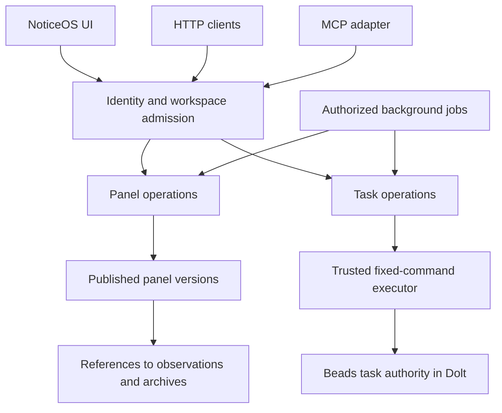

# Remote panel reviews and task access

Give a remote agent the same trustworthy site evidence and task authority as the
NoticeOS UI, without requiring a local checkout, report directory, Beads CLI or
database credential. Preserve standalone installations through the same contracts.

**Reader:** agents building and independently verifying this project.
**Write trigger:** an agreed contract changes or source inspection changes a
design assumption. **End condition:** promote implemented contracts into the
panel, tenancy and setup documentation; audit the scope through Beads, record a
git-history reference on the epic, then delete this temporary brief.

This is a **build contract**, not a claim that remote access is shipped.
The inspected source baseline is `145cd2e0fbd7470d38df3d682979f51979cfc99d`
(2026-10-05). Execution, ownership and completion live in epic **`ro-cvl9`**;
read its current children with `bd list --parent ro-cvl9`, then `bd show`.
Do not turn this document into a second task register.

## The outcome

An authorized agent connects to NoticeOS, chooses a workspace and site, reads its
latest complete panel and any freshness limitations, checks existing tasks, and
records a finding tied to that exact panel version. Another agent can resume the
review later and see the same evidence. Retrying an interrupted task operation
does not create another task or comment. Two agents cannot both win a claim.

The first release supports this explicit, human-directed workflow. It does not
enable autonomous execution, buy more provider data, alter measurement policy or
activate production hosting. Those remain separate decisions under
[AGENTS.md](../../AGENTS.md) and [configuration ownership](../23-configuration-ownership.md).

## Build on what exists

The shared vocabulary is in [CONTEXT.md](../../CONTEXT.md). A workspace is the
tenant boundary; a site is an asset in the code. Use **site** in user-facing copy.

| Existing responsibility | Implementation to extend |
|---|---|
| Normalized observations and provider confirmation | [`signal-store.ts`](../../workers/ingest/src/signal-store.ts), [`panel-source.ts`](../../workers/ingest/src/panel-source.ts), [`signal-trends.ts`](../../apps/tower/worker/signal-trends.ts) |
| Collection families and complete archive landings | [`serp-panel-landings.ts`](../../workers/ingest/src/serp-panel-landings.ts), [`signal-dumps.ts`](../../workers/ingest/src/signal-dumps.ts) |
| Panel assembly, analysis and report publication | [`signal-panels-refresh.mjs`](../../scripts/signal-panels-refresh.mjs), [`signal-history.mjs`](../../scripts/signal-history.mjs), [`signal-history-analyze.mjs`](../../scripts/signal-history-analyze.mjs) |
| Scheduled refresh and review filing | [`panel-refresh.mjs`](../../scripts/runner/panel-refresh.mjs), [`panel-review.mjs`](../../scripts/runner/panel-review.mjs), [`config.mjs`](../../scripts/runner/config.mjs) |
| Existing read-only MCP route | [`mcp-route.ts`](../../apps/tower/worker/mcp-route.ts), admitted by [`index.ts`](../../apps/tower/worker/index.ts) |
| Hosted task HTTP API and runtime composition | [`hosted-tasks-api.mts`](../../scripts/hosted-tasks-api.mts), [`hosted-task-runtime.mts`](../../scripts/hosted-task-runtime.mts), [`hosted-task-server.mts`](../../scripts/hosted-task-server.mts) |
| Fixed task commands, confinement and project resolution | [`hosted-task-command.mts`](../../scripts/hosted-task-command.mts), [`hosted-task-executor.mts`](../../scripts/hosted-task-executor.mts), [`task-directory.mts`](../../packages/postgres/src/task-directory.mts) |
| Identity, task evidence metadata and project context | [`identity.mts`](../../packages/postgres/src/identity.mts), [`task-metadata.mts`](../../packages/contract/src/task-metadata.mts), [`project-context.mjs`](../../scripts/project-context.mjs) |

The hosted task path already composes real operations; the Tower Worker's
read-only fallback is not the whole implementation. The existing MCP route is a
limited read adapter, not proof of public-client authentication or complete MCP
interoperability. Reuse its admitted application operations, then qualify the
remote transport with supported clients.

## One application boundary

Put authorization, publication rules and mutation guarantees in shared server
operations. HTTP, MCP and the UI adapt those operations; they must not maintain
independent queries, permission rules or versions of the task lifecycle. This
does not require a new microservice or a general workflow engine.

Keep the existing Postgres workspace isolation and trusted task-project directory.
Dolt remains the task authority, with `bd` the only writer inside the confined
server executor. A task snapshot displayed by the Tower is a read model, not a
mutation precondition. Clients never select a database, server path, executable,
raw CLI arguments, branch or volume. See the existing
[hosted placement contract](../23-configuration-ownership.md).

## Published evidence contract

Measurements and raw archives remain authoritative. A published panel is an
immutable derived version that identifies exactly which evidence and analysis
produced it. Reuse the current analyzer and publication machinery behind a
storage adapter; standalone disk and hosted storage implement the same behavior.

The shared contract must carry these facts without duplicating their derivation:

| Fact | Required meaning |
|---|---|
| Identity | Workspace, site, opaque panel version, schema version and analysis version |
| Provenance | Exact observation revisions, archive identifiers/checksums, provider resource and connection identity, configuration revision |
| Time | Build/publication timestamps separately from each family's observation window, provider report date and last successful confirmation |
| Completeness | Expected families from saved configuration, required/advisory role, applicability, coverage, finality and explicit missing/failed reasons |
| Artifacts | Names, types, sizes, checksums and authorized retrieval references for summary and detailed evidence |
| Review identity | The review period and exact panel version used by a review or finding |

Use the existing family registry and saved settings as the source of expected
families. Do not copy a provider list into tests or require every provider to
report the same date. A daily search series, weekly page snapshot and manual
export have different coverage and cadence. Advisory exports expose their age
without indefinitely blocking a review that does not require them. An empty or
unconfigured panel cannot become complete by vacuous agreement.

Keep four questions separate: **was collection successful; is the result
complete; is its reporting period current enough; is its data final?** Preserve
unknown, unavailable, not applicable and provisional states. Missing evidence is
not zero. Repeated values are not proof that collection failed.

The immutable version records facts and the policy revision used to build it.
Freshness is evaluated at read time against those facts and the applicable saved
policy, with an `asOf` timestamp. A stored `fresh: true` never stays true merely
because a retired directory stopped changing. Policy changes do not rewrite old
artifacts; distinguish their publication verdict from current eligibility.

Cleanup may retire unreferenced staged or failed builds. It must preserve published
versions referenced by retained review/task evidence. Define retention with those
references in mind; never replace an unavailable historical version with `latest`
or leave a task silently pointing to a deleted artifact.

### Publication and review ordering

Use durable collection-completion evidence and bounded reconciliation to trigger
the affected site's publication. A fixed clock gap or a line in process output
is not proof of readiness. Coalesce duplicate requests for the same workspace,
site and input generation; recover pending work after a crash.

Capture the input revisions before assembly. Validate required artifacts, then
commit the version's manifest and advance its latest-complete pointer only when
publication has succeeded. Readers must see either the old complete version or
the new complete version. A slow older job cannot replace a newer version.
Define ordering from the intended input/configuration generation, not whichever
job finishes last. A failed build leaves the last good version readable, with
its actual age and the current publication failure visible.

Only then may the review filer create or update a review task. Pin its evidence
to the published version, not to a mutable `latest` path or an archive landing
that has not been published. Deduplicate the logical review by workspace, site
and review period; a retry must not create another bead. If a later version
materially changes an existing review's evidence, add an explicit superseding
reference under the task-write guarantees, preserving the original reference.

No cross-store atomic transaction is assumed. Persist enough operation identity
and progress to reconcile publication and Beads filing after a lost response.
Expose an actionable failure when recovery cannot complete; do not silently lose
the review or loop forever.

## Remote reads and task writes

Offer bounded operations for discovering authorized sites/projects, reading
latest or specific panel versions, inspecting family status, and fetching
specific evidence details. Large rows and history need pagination with counts
and truncation flags; a sampled result must never imply full coverage. Versioned
exports carry their provenance. Expiring download links can be renewed after
authorization without changing the version. Reads do not call paid providers or
silently trigger collection.

Expose task list/search, detail, history, create, claim, update, comment and close
through the existing typed command planner. Share validation, limits and error
semantics between HTTP and MCP. Add only the typed evidence-reference fields
needed for panel version, finding identity and operation identity to the shared
metadata contract. Never accept an arbitrary metadata/CLI escape hatch.

Task writes require:

- **Safe retry:** scope an idempotency key to workspace, principal and operation;
  bind it to the request content. Reuse with different content conflicts. A
  repeated request returns the recorded outcome after current authorization.
- **Crash recovery:** handle the interval after `bd` commits but before NoticeOS
  records its receipt. Reconcile a durable operation identity against task
  evidence before retrying. If an outcome cannot be established, return an
  explicit pending/unknown result rather than blindly performing it again.
- **Concurrent edits:** compare an authoritative revision, use Beads' supported
  atomic claim behavior, and reject stale writes. Two server instances must
  not both win. Test interaction with supported direct local `bd` access;
  process-local locks alone are insufficient.
- **Accountability:** record the authenticated actor, exact operation and evidence
  reference. Actor labels supplied by a client cannot impersonate another user.
  Recheck current authority at execution, including delayed jobs and retries.
- **Separate authority:** ordinary task writing does not authorize approval-gate
  resolution, protected operations, provider spending or platform maintenance.
  Preserve the existing `tasks.write` / `tasks.decide` distinction.

Do not promise exactly-once behavior from an HTTP key alone. Qualify each exposed
mutation's retry and conflict semantics before offering it through MCP.

## Remote identity and tenant isolation

Use the existing workspace admission and membership model. A workspace selected
by a client is a request, never a grant. For remote MCP, implement the supported
OAuth/resource-discovery flow with maintained protocol libraries and the existing
identity authority; do not hand-roll an unrelated token system. Browser cookies
working locally do not establish remote agent support. Declare and test the
supported MCP protocol/client versions instead of silently changing protocols.

Evidence reads, task writes, human decisions and paid collection are separate
capabilities. Reuse existing scope names where implemented, define additions in
the shared authority contract, and make the agent's granted workspaces/projects
visible and revocable. Protect tokens in storage and logs. Task-write access
must not provide a route for an agent to approve its own human gate.

Tenant identity must survive queues, operation receipts, cache keys, temporary
files, artifact paths, exports and retries—not only HTTP queries. Bound work and
storage per workspace, limit concurrent publication, and coalesce redundant jobs
so one customer's refresh cannot starve others. Verify revocation before a queued
job executes and before an artifact is served. Use existing monitoring to expose
queue age, failed publication and uncertain task outcomes without leaking another
workspace's identifiers or credentials.

The placement contract remains shared Postgres with workspace isolation and
trusted Dolt project resolution. This brief does not authorize a migration,
existing-store backfill, public endpoint activation or raw tenant SQL access.

## Evidence correctness and the original review findings

Treat the reported data anomalies as reproduction leads until exact archives
confirm them. Code findings below refer to the source baseline; the local-tooling
row also identifies observations from an installation inspection, which are not
universal installation facts. A repeated metric alone does not prove a provider
or cache defect.

| Concern | Design and proof required |
|---|---|
| Unchanged GSC clicks never become final | `recordSignalSuccess` stores every successful run but omits unchanged numerical observations; `readPanelTrend` takes provisional state from the stored value's originating run. Use the latest successful confirmation that actually covers that day and provider resource/timezone. Test unchanged zero and nonzero values becoming final, plus failed/absent confirmation and changed resource. Reuse the Tower trend reader's separation of values from confirmation; do not finalize solely by age. |
| Review appears before evidence is published | The fixed refresh schedule and archive-landing-based review filer prove different things. Enforce publication-before-review, retain reconciliation, and test a delayed required family and a crash between publication and task receipt. |
| Retired panel remains “fresh” | Evaluate age when reading; include generation and publication identity in every export. Local compatibility tooling must identify the active source and reject ambiguity instead of accepting the first directory found. |
| Bing page values repeat with new collection dates | Preserve and expose each row's provider date separately from collection time. Compare raw payload and normalized output to distinguish a legitimate weekly/historical response from a flattening/merge defect. Never restamp old provider observations as new measurements. |
| Stable LLM reports show no “unchanged” count | `findPriorDump` deduplicates within a report date; its `unchanged` count is not a cross-week stability measure. Add a separate comparable-period assessment, excluding volatile envelope fields while retaining query, period, market and device identity. Equal totals do not establish equal full results. |
| High-spam backlinks receive a celebratory card | Separate raw link counts from assessed referring-domain quality and unknown coverage. A capped domain sample cannot establish an exact clean net across all links. Do not hardcode a new “safe” spam threshold or hide raw counts; qualify the positive claim with representative evidence and the existing measurement-policy rules. |
| Suspicious traffic lacks a useful warning | Build a bounded diagnostic from comparable segments, windows and denominators. `first_visit` events are not interchangeable with sessions or users, and portfolio totals do not establish a direct-traffic cohort. Surface a supported anomaly/hypothesis with evidence and missing dimensions, not a proven bot verdict. No automatic filtering, blocking or measurement edits. |
| Local `bd` refuses vaguely / references a recovery checkout | Prior local checks did not reproduce the blanket refusal; the inspected installation's wrapper referenced a recovery checkout. Reproduce the failure for each affected setup before changing access. Address recovery-path coupling and the source's generic refusal diagnostics with a stable approved tool installation, versioned binding, safe reason codes and repair instructions. Do not redirect a trusted executor to arbitrary mutable source. Preserve separately granted client-spoke and application-host access. |
| Docs guess sibling report paths | Replace guessed paths with installation-aware discovery for the compatibility client, and remote panel discovery for hosted users. Do not relocate retained stores or delete old archives as an incidental docs fix. |
| Default config files are described as live settings | Runtime settings come from the store and are edited in the Tower. `config/` holds product defaults; installation exports are snapshots. Update the panel/setup instructions and generated project context together so a fresh agent gets the correct source of truth. |

Provider contracts to consult when reproducing these cases:
[GSC finality metadata](https://developers.google.com/webmaster-tools/v1/searchanalytics/query),
[Bing page statistics](https://learn.microsoft.com/en-us/dotnet/api/microsoft.bing.webmaster.api.interfaces.iwebmasterapi.getpagestats?view=bing-webmaster-dotnet),
[DataForSEO referring domains](https://docs.dataforseo.com/v3/backlinks-referring_domains-live/),
and [GA4 known-bot handling](https://support.google.com/analytics/answer/9888366?hl=en).
These contracts guide fixtures; they do not authorize live provider requests.

## Delivery order and compatibility

**Correctness comes first.** Fix unchanged-value finality and the premature
review behavior without waiting for remote authentication. A narrow interim
publication check must verify the required collection's actual published inputs,
not merely that some panel directory exists. Preserve the last good evidence.

Then establish immutable publication and family-level status, expose those
operations through authorized HTTP/MCP reads, and qualify remote identity and
task-write guarantees. Those latter capabilities can be developed independently;
the complete remote review workflow depends on all of them. Keep dependency edges
in Beads limited to these actual prerequisites, not every item in the parent
hosted-tenancy epic. Quality diagnostics and local discovery can progress without
waiting for the whole cloud path.

Preserve the supported standalone setup. A local adapter may still use `bd` and
disk, but new hosted users connect an account/workspace and select a site/project
in NoticeOS. They do not provision a local Dolt store, install `bd` or copy report
files. Provider credentials stay on Integrations; never add them to client setup
instructions. Reuse [project setup](../project-setup.md), separating local runtime
installation from connecting a repository or a remote reviewer.

A search-facing recommendation still needs the site's context pack, current
source and [freeze register](../freeze-register.md) or an authoritative versioned
representation of them. Panel access alone is not permission to change a site
inside a measurement window. Do not recreate repository policy as stale MCP
instructions.

## Focused verification

The defining acceptance is one synthetic workflow: two workspaces with colliding
site and task identifiers; a delayed required family; publication; a remote panel
read; a finding pinned to that version; a retried create/comment; competing claims;
and access revoked before delayed work executes. The other workspace sees none of
the evidence, work or artifacts. Include HTTP/MCP parity and an ordinary standalone
path. Use generated identities, mock providers and disposable stores throughout.

| Changed boundary | Existing focused proof locations |
|---|---|
| Finality and series reads | `workers/ingest/test/panel-source.test.ts`, `signal-series.test.ts`, `google-signals.test.ts`; `apps/tower/test/signal-trends.test.ts`, `signal-trends-newest-write.test.ts` |
| Publication and review recovery | `scripts/signal-panels-refresh.test.mjs`, `signal-auto-publication.test.mjs`, `runner-panel-refresh.test.mjs`, `runner-panel-review.test.mjs`, relevant `signal-history*.test.mjs` |
| Flattening, repeats and insight honesty | `scripts/signal-archive.test.mjs`, `signal-insights.test.mjs`; corresponding provider dump fixtures |
| Shared reads and remote admission | `apps/tower/test/mcp-route.test.ts`; `scripts/workspace-admission.test.mjs`; add targeted supported-client transport tests |
| Task authority, retry and concurrency | `scripts/hosted-tasks-api.test.mjs`, `hosted-task-command.test.mjs`, `hosted-task-executor.test.mjs`, `hosted-task-executor-compose.test.mjs`, `hosted-task-http-native.test.mjs`, `hosted-task-decisions-native.test.mjs`, `postgres-task-directory.test.mjs` |
| Actual UI composition where changed | `scripts/hosted-task-browser-native.test.mjs`, `apps/tower/test/hosted-task-transport.test.ts`; the affected onboarding journey only |

Add proofs for new behavior, not tests that recite manually maintained provider
lists or method counts. One independent verifier runs the affected checks and
records commands, source inputs, elapsed time and limitations. Reuse valid evidence;
do not have every builder and verifier repeat the same suites. Full gates stay in
CI under [local verification](../../CONTRIBUTING.md#local-verification). The local
target is 80% less work than a full run, not permission to omit a relevant
isolation or recovery check; do not invent CPU savings.

## Instructions for the receiving agent

Read the repository's current `AGENTS.md`, this contract, the relevant sources and
your leaf's `bd show` before editing. Claim only that unblocked leaf, keep its
acceptance and dependencies in Beads, and close it with the actual commit and
independent focused evidence. Do not claim the whole epic as one coding task.

Distinguish local implementation from deployment qualification. Use disposable
fixtures; inspect retained installations only within their recorded authorization.
Follow the existing human-approval process for protected actions. This handoff
adds no production access, migrations, deployment, credential changes, paid
collection, budget or push authorization.

Update durable API/panel/setup documentation when each behavior becomes real.
When this project's contract has been accounted for, follow the
[audit-then-delete rule](../../config/beads.README.md#docs-are-not-registers--every-project-doc-has-a-lifecycle-ending-in-deletion)
instead of leaving a stale implementation plan behind.
